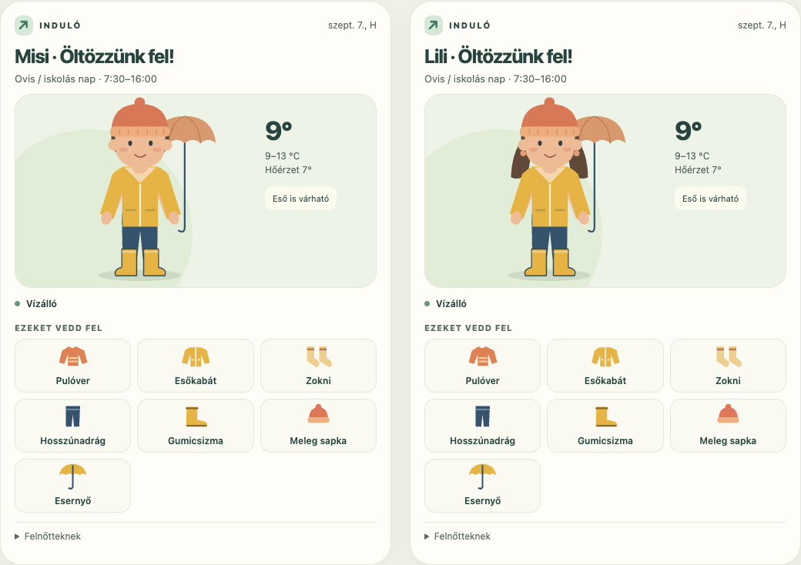
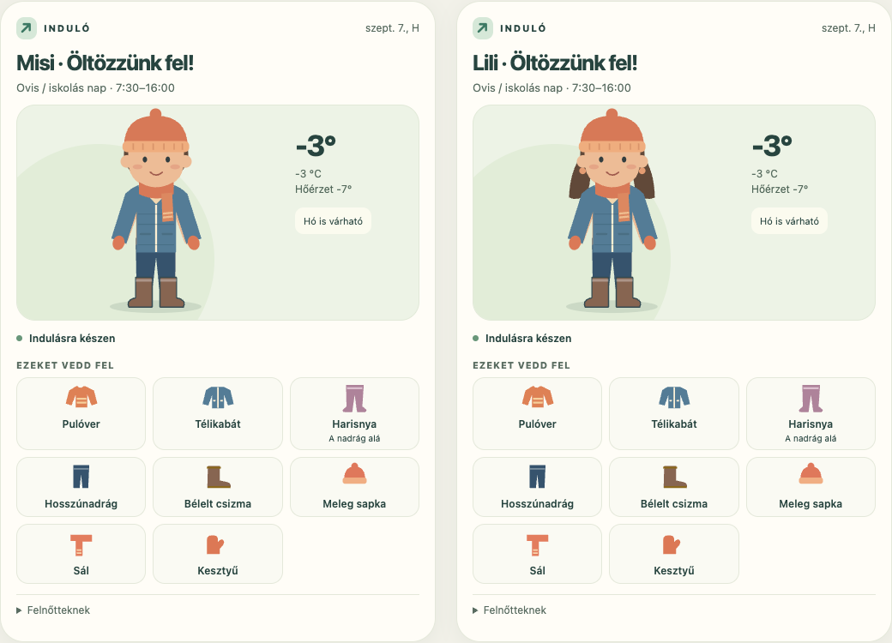
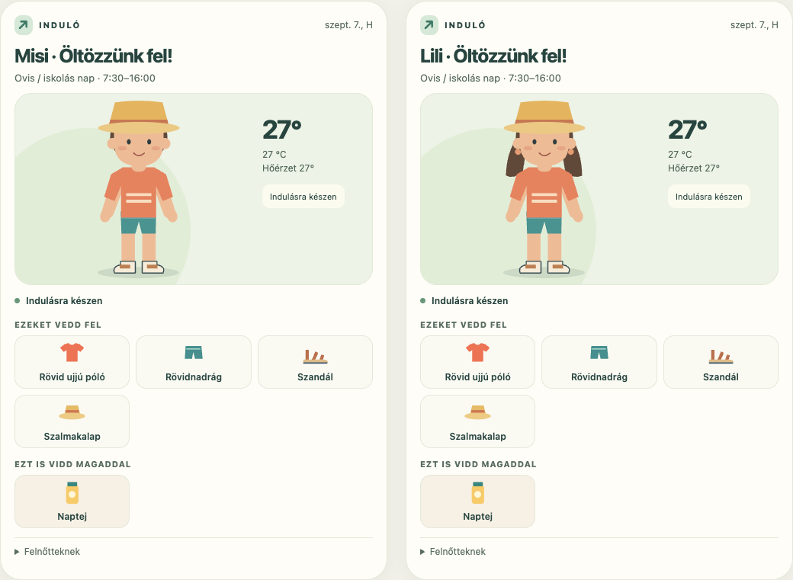
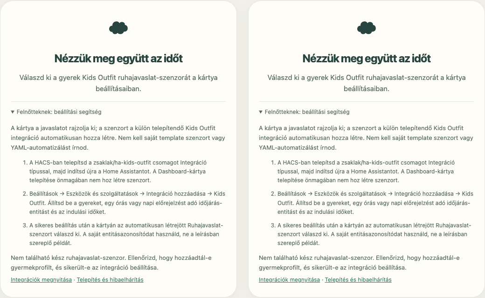

# Kids Outfit Card – Induló

[English](README.md)

A 4–12 éves gyerekek egy pillantásból láthatják, milyen ruhában induljanak el. A kisfiú vagy kislány az egész ovis vagy iskolás nap időjárásához illő ruhát viseli. A figura állandó, a ruhák és kiegészítők változnak.



## Telepítés

Két csomag szükséges: a **Kids Outfit integráció** elkészíti a ruhajavaslatot és létrehozza a szenzort, a **Kids Outfit Card** pedig megjeleníti azt.

1. A HACS egyéni tárolóihoz add hozzá a `https://github.com/zsaklak/ha-kids-outfit` repót **Integráció** típussal, majd telepítsd.
2. Indítsd újra a Home Assistantot. Szükséges verzió: **2026.9 vagy újabb**.
3. Nyisd meg: **Beállítások → Eszközök és szolgáltatások → Integráció hozzáadása → Kids Outfit**. Állítsd be a gyermeket, az időjárás-entitást és az indulás/hazaérkezés idejét.
4. A HACS egyéni tárolóihoz add hozzá a `https://github.com/zsaklak/kids-outfit-card` repót **Dashboard** típussal, majd telepítsd.
5. Ellenőrizd a **Beállítások → Irányítópultok → Erőforrások** alatt a `/hacsfiles/kids-outfit-card/kids-outfit-card.js` erőforrást, **JavaScript-modul** típussal. Ha a HACS nem vette fel, add hozzá.
6. Töltsd újra a böngészőt, add hozzá a Kids Outfit kártyát az irányítópulthoz, és válaszd ki a gyermek létrejött **Ruhajavaslat** szenzorát.

```yaml
type: custom:kids-outfit-card
entity: sensor.misi_ruhajavaslat
language: auto
compact: true
```

A szenzorazonosító csak példa: a saját Home Assistantodban létrejött azonosítót használd.

## Mit vesz figyelembe?

- Alapértelmezés szerint 7:30–16:00 között, az egész ovis vagy iskolás napra javasol ruhát. Mindkét időpont állítható.
- Hőmérséklet, hőérzet, szél, eső, hó és a rendelkezésre álló UV-adat alapján választ rétegeket és kiegészítőket.
- A hidegérzékenység gyermekenként állítható; pozitív érték melegebb ruházatot jelent.
- Zárt cipőhöz zoknit, 5 °C alatti korrigált hőérzetnél meleg zoknit vagy választható harisnyát javasol. A harisnya a hosszúnadrág alá kerül, a zokni helyett.
- Napsütésben szalmakalap vagy baseballsapka választható, mindkét karakterhez.
- Az úszós beállítás fürdőruhát és törölközőt tesz a csomaglistára. Amíg aktív, minden nap megjelennek; úszás után kapcsold ki. A fürdőruha nem utcai öltözet.

A javaslat általános öltözködési segítség. Viharos időben és hiányzó adatoknál a kártya felnőtt segítségét kéri.

## Fali tablet és megjelenés

A `compact: true` beállítás rövidebb, fali tabletre szánt elrendezést ad. A képen két kártya látható 1280×800-as nézetben.



A kártya vizuális szerkesztőjében a szenzor, nyelv, karakter, cím, színek és hőmérsékletegység is megadható. A ruhajavaslat szabályait a gyermek integrációs beállításaiban módosíthatod. A rajzhoz szöveges ruhalista is tartozik; a jelentés nem csak színeken alapul.



## Nyelvek és adatkezelés

Az integráció és a kártya az **EU mind a 24 hivatalos nyelvét** tartalmazza: angol, bolgár, cseh, dán, észt, finn, francia, görög, holland, horvát, ír, lengyel, lett, litván, magyar, máltai, német, olasz, portugál, román, spanyol, svéd, szlovák és szlovén.

A `language: auto` a Home Assistant felhasználójának nyelvét követi. Például a `language: de` német, a `language: hu` magyar felületet ad. A kártya további nyelvekkel és saját `translations` szótárral bővíthető; a hiányzó fordítások angolra esnek vissza. Nem használ futás közbeni fordítószolgáltatást.

A fordítások első változatok: a teljességüket és megjelenésüket teszteljük, de ez nem helyettesíti az anyanyelvi ellenőrzést. Nyelvi javításokat is várunk az Issues alatt.

A ruhajavaslat helyben készül. A gyermek neve és beállításai a Home Assistantban és annak előzményeiben maradnak. A csomag nem küld gyermekadatot külső szolgáltatásnak, az előrejelzést a már beállított időjárás-integráció biztosítja.

## FAQ – gyakori kérdések

### Milyen időjárás-szolgáltatót válasszak?

**Kizárólag olyan szolgáltatás megfelelő, amely a kiválasztott `weather.*` entitáson keresztül órás vagy napi előrejelzést is ad. Az aktuális időjárás vagy hőmérséklet önmagában nem elegendő.**

Az órás előrejelzésnek le kell fednie az indulástól hazaérkezésig hátralévő időszakot. A napi előrejelzésnek tartalmaznia kell a célzott nap minimum- és maximum-hőmérsékletét. Napi becslésnél a minimum éjszakára is eshet, ezért a javaslat a nappali igénynél melegebb lehet.

### Melyik szenzort kell kiválasztani?

| Hol? | Mit válassz? |
| --- | --- |
| A Kids Outfit integráció beállításában | Az órás vagy napi előrejelzést biztosító `weather.*` entitást. |
| A Kids Outfit kártyán | A gyermek számára automatikusan létrehozott **Ruhajavaslat / Outfit `sensor.*`** entitást. |

Nem kell kézzel template szenzort, YAML-automatizálást vagy előrejelzés-lekérő szkriptet készítened. A kártyán ne az időjárás-entitást vagy egy hőmérőt válassz. A dokumentációban szereplő szenzorazonosítók csak példák.

### Telepítettem a kártyát, miért nincs szenzor?

A kártya önmagában nem hoz létre szenzort. Az integrációt is telepíteni kell, majd a HA újraindítása után hozzá kell adni a Kids Outfit integrációt és egy gyermekprofilt. Ekkor jön létre a szenzor.

### Miért nincs figura?

A kártya érvényes, friss javaslat nélkül nem talál ki ruházatot. Külön jelzi a hiányzó vagy rossz szenzort, az elérhetetlen adatot, a lejárt előrejelzést és a hiányos vagy nem kompatibilis adatokat. Nyisd le a felnőtteknek szóló beállítási segítséget, és ellenőrizd a szenzor azonosítóját, az integráció állapotát és a szolgáltató előrejelzését.



Az integráció 15 percenként frissít. A kártya legfeljebb 45 percig, illetve a javasolt időszak végéig mutatja a javaslatot. A böngésző újratöltése nem kér új időjárás-előrejelzést.

### Hogyan ellenőrizzem az előrejelzést?

A **Fejlesztői eszközök → Műveletek** alatt a saját időjárás-entitásoddal:

```yaml
action: weather.get_forecasts
target:
  entity_id: weather.otthon
data:
  type: hourly
```

Csak napi előrejelzés esetén használj `type: daily` értéket. Napi adatnál a `temperature` és `templow` mező is szükséges. Ellenőrizd a HA időzónáját és a megadott időket. Hazaérkezés után a következő naptári nap a cél, hétvégén is; iskolai naptárkezelés még nincs.

### Hol választható a harisnya vagy a baseballsapka?

**Beállítások → Eszközök és szolgáltatások → Kids Outfit → Konfigurálás.** A hidegben viselt lábruházatnál a meleg zokni vagy harisnya, a **Napsütésben viselt fejfedő** mezőben a szalmakalap vagy baseballsapka választható. Mindkét karakterhez használhatók. A meglévő profilok alapértelmezése a meleg zokni és a szalmakalap.

Frissítéskor az integrációt és a kártyát is frissítsd, indítsd újra a HA-t, és töltsd újra a böngészőt.

### Van felnőtt figura vagy ESPHome / e-ink változat?

Egyelőre nincs. Ezek fejlesztési ötletek; a jelenlegi kártya böngészős Lovelace-kártya, gyermekkarakterekkel.

## Javaslatok és hibajelentések

A javaslatokat és hibajelentéseket a [GitHub Issues alatt](https://github.com/zsaklak/kids-outfit-card/issues/new/choose) várjuk. Magyarul is írhatsz. Külön űrlap van **hibajelentéshez**, **funkciójavaslathoz** és **fordítási javításhoz**.

Hibánál add meg a Home Assistant és mindkét csomag verzióját, az időjárás-integráció nevét, az előrejelzés típusát, a tapasztalt és elvárt működést. A naplóból és képernyőképből távolítsd el a jelszavakat, tokeneket, gyermekneveket és pontos helyadatokat.

MIT-licenc. A HACS egyéni tárolóként telepíthető csomag nem jelent automatikus bekerülést a HACS alapértelmezett listájába.
