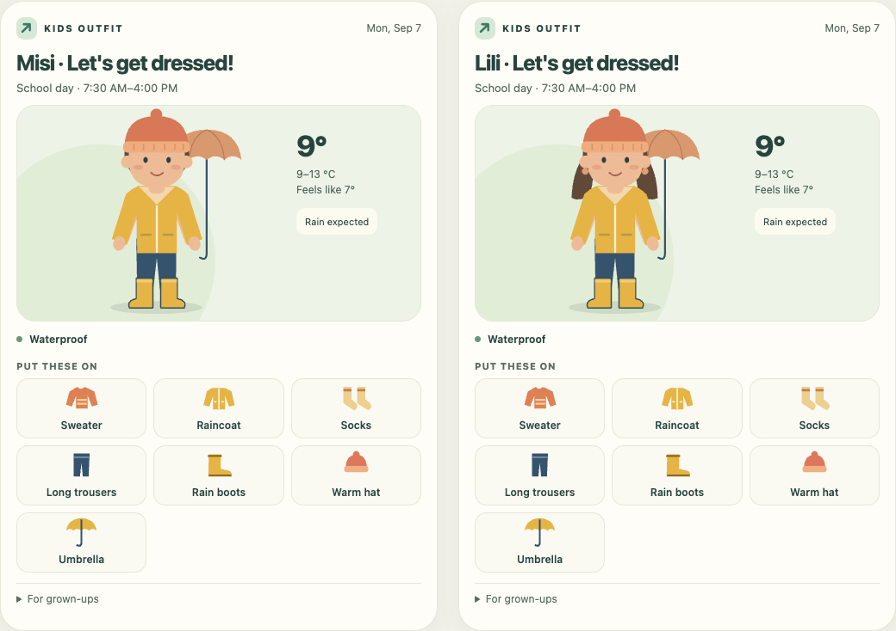
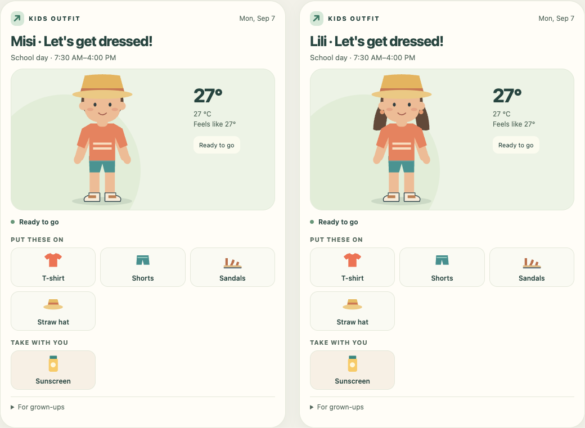
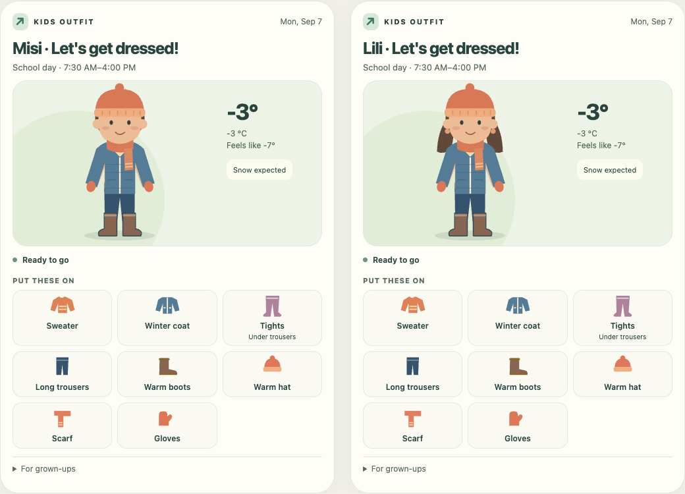
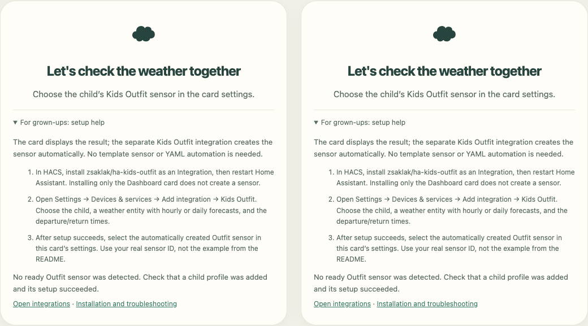

# Kids Outfit Card

[Magyar leírás](README.hu.md)

A language-independent picture of what to wear for the school day, made for children aged 4–12. The same character wears different layers, footwear and accessories. Original SVG artwork, no generated-image drift, fonts/CDNs or runtime dependencies.



## Install

First install [Kids Outfit](https://github.com/zsaklak/ha-kids-outfit) and configure a child.

1. In HACS → Custom repositories, add `https://github.com/zsaklak/kids-outfit-card`, category **Dashboard**.
2. Download the card. Check **Settings → Dashboards → Resources** for `/hacsfiles/kids-outfit-card/kids-outfit-card.js`, type **JavaScript module**. Add it if HACS has not done so.
3. Reload your browser. Add **Kids Outfit** from the card picker and select the child's Outfit sensor.

```yaml
type: custom:kids-outfit-card
entity: sensor.misi_outfit
compact: true
```

Use the real sensor ID from your HA installation; localized IDs may differ. For manual installation copy `dist/kids-outfit-card.js` to `config/www/`, add resource `/local/kids-outfit-card.js` as a JavaScript module, then add the card.

## Configuration

| Option | Default | Meaning |
| --- | --- | --- |
| `entity` | required | Kids Outfit sensor |
| `compact` | `false` | Shorter layout for wall tablets |
| `language` | `auto` | HA user language, or any BCP-47 language tag |
| `character` | `auto` | Use integration setting; override with `boy` / `girl` |
| `title` | child's name + heading | Optional plain text |
| `temperature_unit` | `auto` | HA units, or `°C` / `°F` |
| `skin_color` | `#edbc96` | Six-digit hex colour |
| `hair_color` | `#614939` | Six-digit hex colour |
| `direction` | `auto` | `ltr` / `rtl` override |
| `translations` | `{}` | Any or all text keys, in any language |

The visual editor covers common settings; translations are entered in YAML. Character selection changes hairstyle, not clothing rules. Swimwear is shown only in **Take with you**, never as street clothing.

All [24 official EU languages](https://european-union.europa.eu/principles-countries-history/languages_en) are bundled in both the integration and the card: Bulgarian (`bg`), Croatian (`hr`), Czech (`cs`), Danish (`da`), Dutch (`nl`), English (`en`), Estonian (`et`), Finnish (`fi`), French (`fr`), German (`de`), Greek (`el`), Hungarian (`hu`), Irish (`ga`), Italian (`it`), Latvian (`lv`), Lithuanian (`lt`), Maltese (`mt`), Polish (`pl`), Portuguese (`pt`), Romanian (`ro`), Slovak (`sk`), Slovenian (`sl`), Spanish (`es`) and Swedish (`sv`). All text keys are in [`translations/en.json`](translations/en.json). Use `language: auto` to follow Home Assistant, or select a bundled language with its code (for example `language: de`). To customize any wording, override keys in the card's `translations` mapping:

```yaml
type: custom:kids-outfit-card
entity: sensor.child_outfit
language: de
translations:
  heading: Anziehen und los!
  wear: Das ziehst du an
  pack: Das nimmst du mit
  rain_boots: Gummistiefel
  umbrella: Regenschirm
  # Other keys use the bundled German translation.
```

Missing keys fall back to English. There is no automatic machine translation. Complete new translations can also be added as `translations/<language>.json`, then `npm run build`. Regional locales fall back through their script and base language. RTL is automatically selected for Arabic, Hebrew, Persian, Urdu, Pashto, Divehi and Yiddish; other scripts can set `direction: rtl` explicitly. Dates and numbers use the chosen locale; timestamps use the HA time zone.



## Wall tablet

Use `compact: true` for a 1280×800 landscape tablet. Two complete winter cards fit side by side in the verified example:



The figure has a screen-reader label listing the recommended clothing. Supporting labels do not depend on colour recognition. The card has no animation or external fonts. The adult details section is keyboard-accessible. On expired or unavailable data, the clothing figure is replaced by a request for adult help.

## Arabic, Hindi and Chinese

Arabic (`ar`), Hindi (`hi`) and Chinese in **Simplified (`zh-Hans`) and Traditional (`zh-Hant`) scripts** are also bundled in the integration and card: **27 languages, 28 translation variants** in total.

The card follows the HA user language with `language: auto`. You can explicitly set `language: ar`, `hi`, `zh-Hans` or `zh-Hant`. Chinese regional tags are resolved automatically: `zh` / `zh-CN` / `zh-SG` use Simplified; `zh-TW` / `zh-HK` / `zh-MO` use Traditional. An explicit script takes precedence over the region. Arabic uses a right-to-left layout, including the editor; numeric ranges and entity IDs keep their reading order.

## FAQ

> **Weather provider requirement:** Only a service that supplies **hourly or daily forecasts** through the selected Home Assistant `weather.*` entity is suitable. Current weather or temperature alone is **not enough**. Hourly forecasts must cover the remaining departure-to-return period; daily forecasts must include both the minimum and maximum temperature for the target date.

### Can I choose a baseball cap instead of a straw hat?

Yes. In **Settings → Devices & services → Kids Outfit → Configure**, set the child’s **Sunny-weather headwear** to **Straw hat** (default) or **Baseball cap**. The choice applies to either character whenever sun headwear is recommended; cold weather still uses a warm hat. Update both the integration and card to **0.3.0 or newer**. Existing profiles keep the straw hat.

### Which entity should I select in the card?

Select the **Outfit / Ruhajavaslat sensor** created by the [Kids Outfit integration](https://github.com/zsaklak/ha-kids-outfit). It is a `sensor.*` entity belonging to your child. Do not select `weather.*` or an ordinary temperature sensor. The visual editor now filters the entity picker to the Kids Outfit integration.

The sample `sensor.misi_outfit` in documentation is not a fixed ID. Use the actual ID listed in your own HA installation.

### Where does that sensor come from? Do I need a template?

No template or YAML automation is needed. Install **ha-kids-outfit** in HACS as an **Integration**, restart HA, then go to **Settings → Devices & services → Add integration → Kids Outfit**. Add a child profile and select a forecast-capable weather entity there. The integration creates the Outfit sensor when setup succeeds. Select that sensor in this card. Installing only **kids-outfit-card** is not enough.

### Why is the character missing?

From 0.2.0, the card explains whether the selection is missing, the entity does not exist, the wrong sensor was chosen, the sensor is waiting/unavailable, the forecast expired, or the data is incomplete/incompatible. The adult help section contains the setup steps and detected Outfit sensor IDs.

If the sensor is unavailable or stale, check the Kids Outfit integration's setup/update error and its weather provider. A current temperature alone is not sufficient: the integration needs hourly forecasts covering the remaining day, or a matching daily forecast with a minimum and maximum. [Forecast testing and full troubleshooting](https://github.com/zsaklak/ha-kids-outfit#faq).



### Why are socks or tights missing after updating?

Update **both repositories to 0.2.0**, restart HA and reload the browser. Closed shoes get socks; sandals do not. Below 5 °C adjusted feels-like, the integration offers warm socks or optional tights under long trousers. Choose the preference in the child's **integration options**, not in the card editor. It applies to either character. Tights replace socks; they do not replace the trousers. Underlayers have their own icons, even when the outer clothing hides them on the character. Older integration data still renders, but has no new legwear field.

### Can it run on ESPHome / e-ink, or show an adult?

There is no ESPHome/e-ink renderer or adult character in this release. The current card runs in a browser; a separate renderer would be needed for ESPHome.


## Develop

Node.js 22+, `npm ci`, `npm run build`. The built module is committed so HACS does not need a build step. A new translation JSON is automatically embedded in the module. The build rejects incomplete bundled translations.

Serve this repository (`python3 -m http.server 8768 --bind 127.0.0.1`), open `/demo/`, then run `npm test` after `npx playwright install chromium`. The demo uses labeled fixture data produced by the integration's actual rules.

Tests cover weather and legwear scenarios, nine diagnostic states, the editor contract, older integration data, both characters, all 28 translation variants including Arabic RTL, 390px overflow and HTML escaping. `BROWSER_CHANNEL=chrome` can use installed Chrome. The compact winter pair was visually checked at 1280×800. Physical tablet and real Lovelace visual-editor testing remain deployment acceptance steps.

MIT licensed. Contributions and translations welcome. HACS custom-repository installation does not mean automatic inclusion in the default directory.

## Suggestions and bug reports

Please submit suggestions and bug reports through [GitHub Issues](https://github.com/zsaklak/kids-outfit-card/issues/new/choose). Choose **Bug report**, **Feature request**, or **Translation correction**. Reports are welcome in any language. For setup questions, read the [FAQ](#faq) first; if the problem persists, include both package versions, your weather integration and the forecast type. Remove credentials, personal names and precise locations from logs and screenshots.

The bundled translations are initial translations, with automated completeness and rendering checks. Native-speaker corrections are welcome through Issues; these checks do not replace linguistic review.

## Source structure

`src/localization.js` resolves language, script and direction for both the card and editor. `src/data.js` validates sensor data before any clothing is drawn. `src/styles.js` owns layout, while `src/art.js` owns artwork and `src/card.js` composes the UI. The build combines these local modules into one dependency-free HACS asset and checks all translation keys. `npm test` runs pure helper regression tests followed by browser tests.
