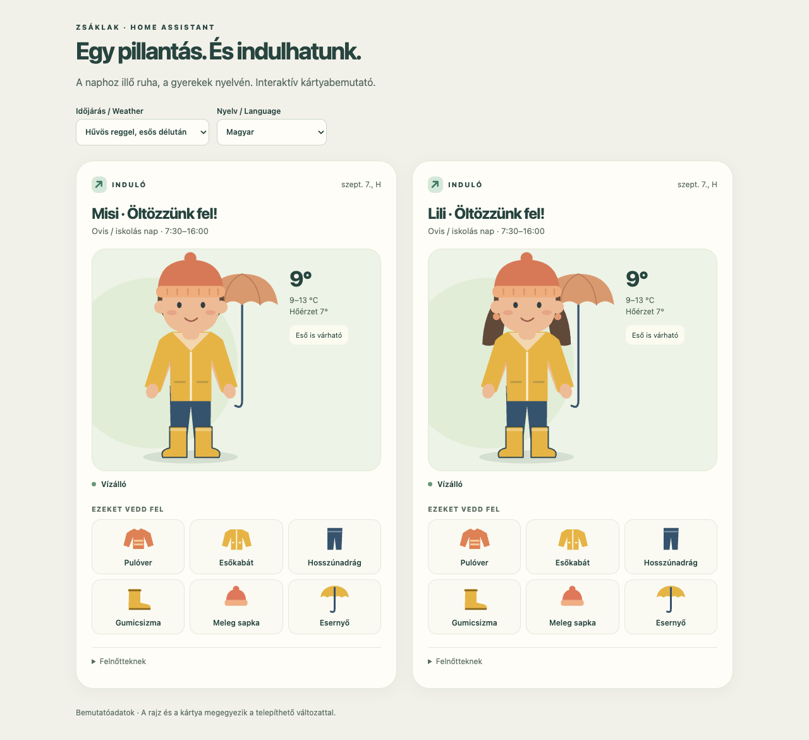
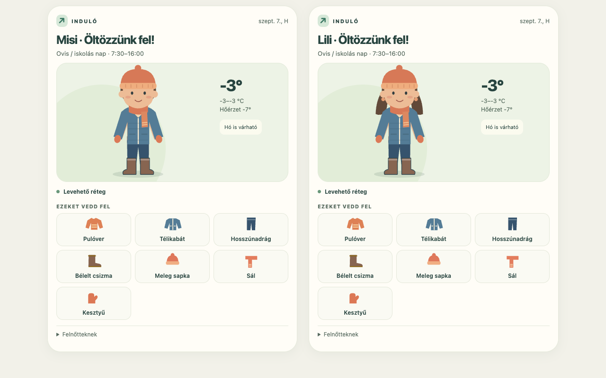

# Kids Outfit Card

A language-independent picture of what to wear for the school day, made for children aged 4–12. The same character wears different layers, footwear and accessories. Original SVG artwork, no generated-image drift, fonts/CDNs or runtime dependencies.



## Install

First install [Kids Outfit](https://github.com/zsaklak/ha-kids-outfit) and configure a child.

1. In HACS → Custom repositories, add `https://github.com/zsaklak/kids-outfit-card`, category **Dashboard**.
2. Download the card. Check **Settings → Dashboards → Resources** for `/hacsfiles/kids-outfit-card/kids-outfit-card.js`, type **JavaScript module**. Add it if HACS has not done so.
3. Reload your browser. Add **Kids Outfit** from the card picker and select the child's Outfit sensor.

```yaml
type: custom:kids-outfit-card
entity: sensor.misi_outfit
compact: true
```

Use the real sensor ID from your HA installation; localized IDs may differ. For manual installation copy `dist/kids-outfit-card.js` to `config/www/`, add resource `/local/kids-outfit-card.js` as a JavaScript module, then add the card.

## Configuration

| Option | Default | Meaning |
| --- | --- | --- |
| `entity` | required | Kids Outfit sensor |
| `compact` | `false` | Shorter layout for wall tablets |
| `language` | `auto` | HA user language, or any BCP-47 language tag |
| `character` | `auto` | Use integration setting; override with `boy` / `girl` |
| `title` | child's name + heading | Optional plain text |
| `temperature_unit` | `auto` | HA units, or `°C` / `°F` |
| `skin_color` | `#edbc96` | Six-digit hex colour |
| `hair_color` | `#614939` | Six-digit hex colour |
| `direction` | `auto` | `ltr` / `rtl` override |
| `translations` | `{}` | Any or all text keys, in any language |

The visual editor covers common settings; translations are entered in YAML. Character selection changes hairstyle, not clothing rules. Swimwear is shown only in **Take with you**, never as street clothing.

English and Hungarian are bundled. All text keys are in [`translations/en.json`](translations/en.json). To use another language immediately, translate those keys in the card's `translations` mapping:

```yaml
type: custom:kids-outfit-card
entity: sensor.child_outfit
language: de
translations:
  heading: Anziehen und los!
  wear: Das ziehst du an
  pack: Das nimmst du mit
  rain_boots: Gummistiefel
  umbrella: Regenschirm
  # Translate the remaining keys from translations/en.json for a full translation.
```

Missing keys fall back to English. There is no automatic machine translation. Complete new translations can also be added as `translations/<language>.json`, then `npm run build`. Regional locales fall back to their base language. RTL is automatically selected for Arabic, Hebrew, Persian, Urdu, Pashto, Divehi and Yiddish; other scripts can set `direction: rtl` explicitly. Dates and numbers use the chosen locale; timestamps use the HA time zone.

## Wall tablet

Use `compact: true` for a 1280×800 landscape tablet. Two complete winter cards fit side by side in the verified example:



The figure has a screen-reader label listing the recommended clothing. Supporting labels do not depend on colour recognition. The card has no animation or external fonts. The adult details section is keyboard-accessible. On expired or unavailable data, the clothing figure is replaced by a request for adult help.

## Develop

Node.js 22+, `npm ci`, `npm run build`. The built module is committed so HACS does not need a build step. A new translation JSON is automatically embedded in the module. The build rejects incomplete bundled translations.

Serve this repository (`python3 -m http.server 8768 --bind 127.0.0.1`), open `/demo/`, then run `npm test` after `npx playwright install chromium`. The demo uses labeled fixture data produced by the integration's actual rules.

Tests cover eight scenarios, both characters, HU/EN/custom Arabic, 390px overflow, stale data and HTML escaping. `BROWSER_CHANNEL=chrome` can use installed Chrome. The compact winter pair was visually checked at 1280×800. Physical tablet and real Lovelace visual-editor testing remain deployment acceptance steps.

MIT licensed. Contributions and translations welcome. HACS custom-repository installation does not mean automatic inclusion in the default directory.
